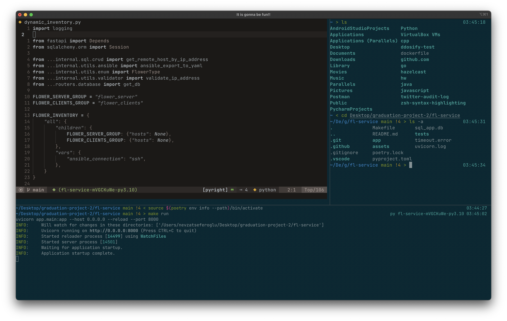

## dotfiles

### Current Stack

- Iterm2
- lunarvim

### Default.json

`Default` profile of my `Iterm2`.

### lvim

Lunarvim configuration directory.

- Colorscheme settings

```lua
lvim.colorscheme = "zenbones"
-- transparent_background is mutual exclusive with other settings
-- More info: https://github.com/mcchrish/zenbones.nvim
vim.g.zenbones = {
  darkness = 'stark',
  transparent_background = true,
  colorize_diagnostic_underline_text = false
}
```



#### Settings;

Changes which are made on the top of the configurations which come in `lunarvim`.

- **Enabled transparent background for**;
  - Colorscheme via its setup configuration.
  - Set `transparent_window = true` (lunarvim ~ (config/default.lua)).
- Disabled `cursorline = false` (lunarvim ~ (config/settings.lua)).
- Disabled `pylyzer` for now. It breaks the liting while openning python file.

### Plans

- Show custom keybindings in table view.
